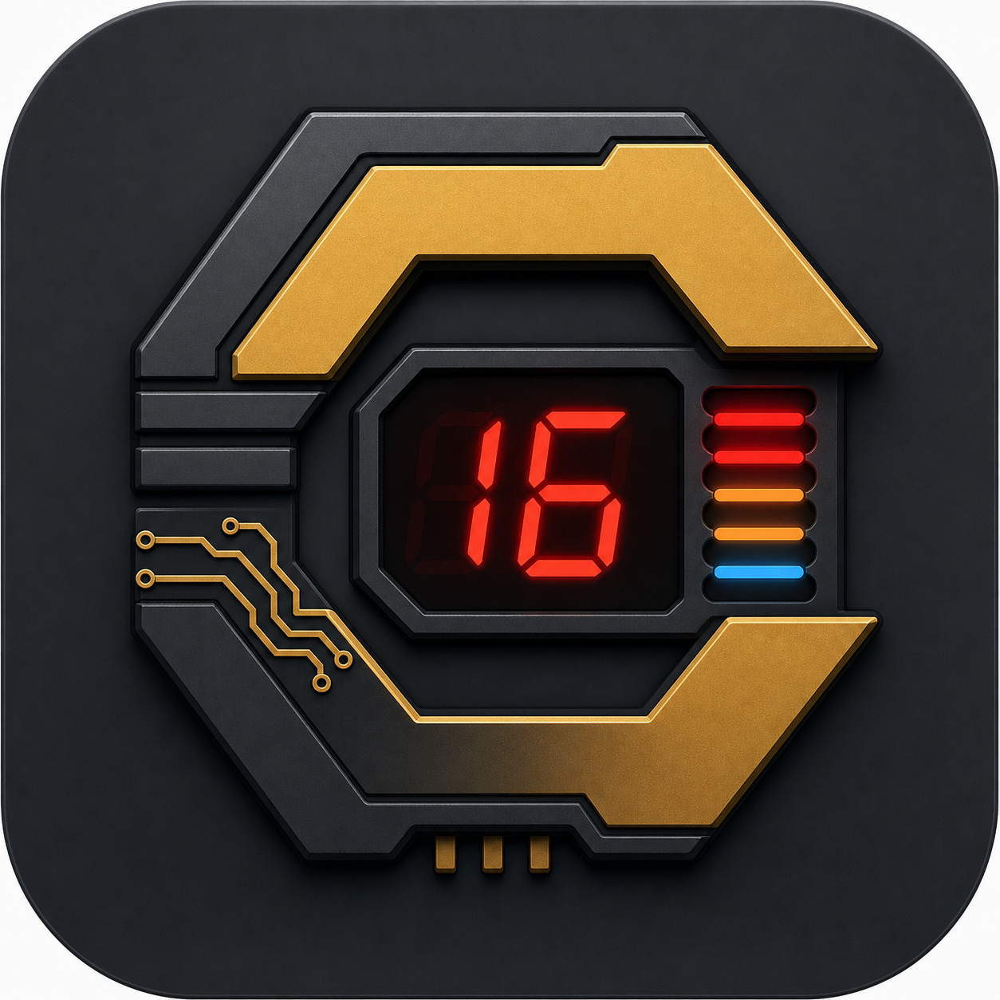

# Calcumaker Logo Concept

This branch adds the original image-model render for review alongside the
current SVG brand assets. It is concept art, not a production-ready logo file.

## Prompt Summary

- Technical hardware mark for Calcumaker / Calcumaker 16.
- Programmer RPN calculator, base-16 identity, seven-segment display, real
  hardware feel.
- Dark graphite case, shift gold, red LED glow, cool blue accent.
- Vector-friendly badge silhouette, avoiding HP/Voyager wordmark cues.
